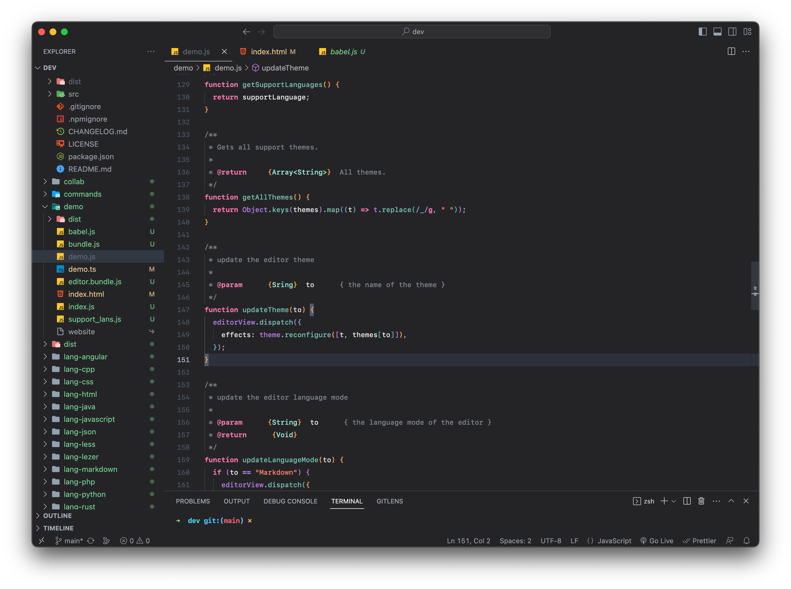

# Screenshot



# Installation

```bash
git clone https://github.com/Lorpaves/vscode-flat-dark-theme.git
```

```bash
cd vscode-flat-dark-theme

npm install -g vsce

vsce package    # this will generate the *.vsix file to let you install the theme from the extension
```
